# Food Delivery App 👋


[](#)


A Food Delivery App UI Developed with Flutter Made with 💙

# Flutter Version

Flutter 2.5.3

# 💻 Requirements

- Any Operating System (ie. MacOS X, Linux, Windows)
- Any IDE with Flutter SDK installed (ie. IntelliJ, Android Studio, VSCode etc)
- A little knowledge of Dart and Flutter


# Download
<a href="release/app-release.apk"></img></a> 

# Screenshots

| 1                                  | 2                                  |
| ---------------------------------- | ---------------------------------- |
| 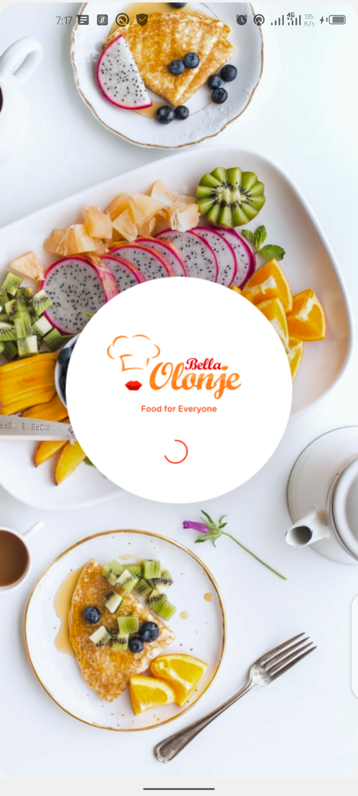 | 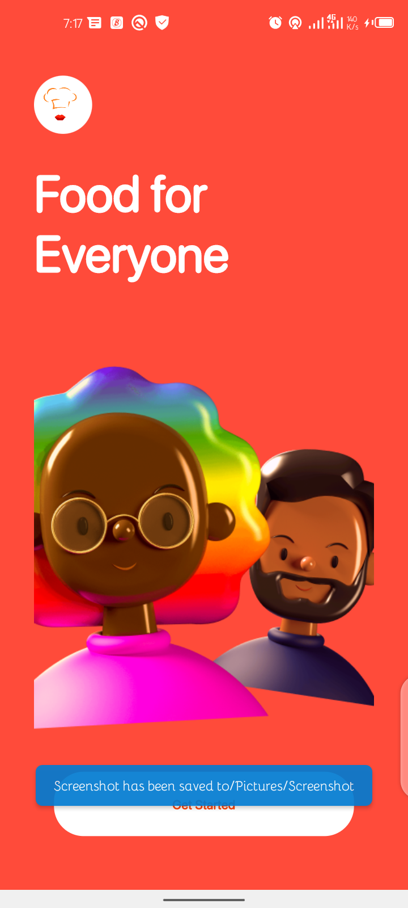 |

| 3                                  | 4                                  |
| ---------------------------------- | ---------------------------------- |
| 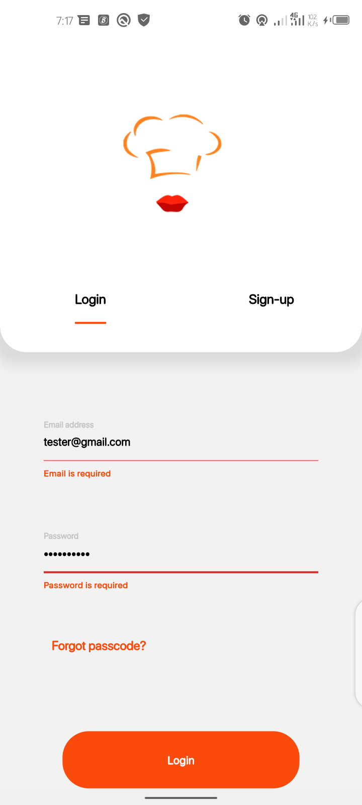 | 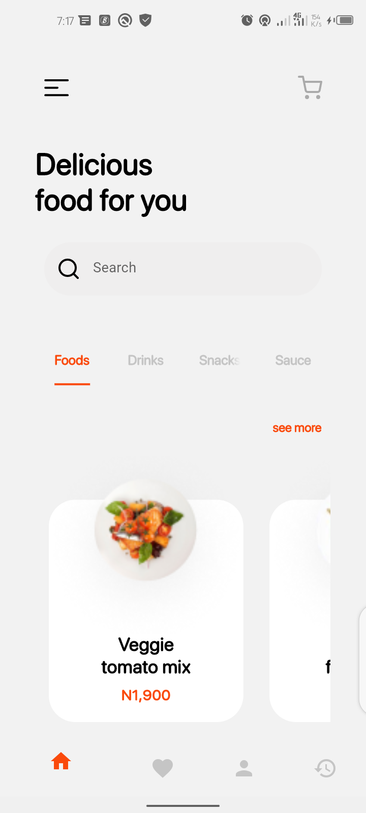 |

| 5                                  | 6                                  |
| ---------------------------------- | ---------------------------------- |
| 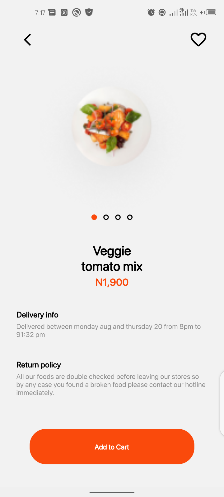 | 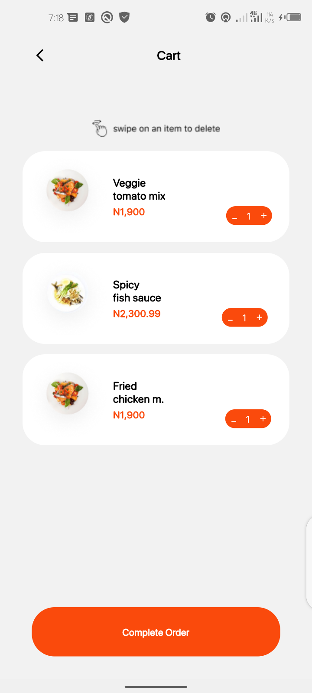 |

| 7                                  | 8                                  |
| ---------------------------------- | ---------------------------------- |
| 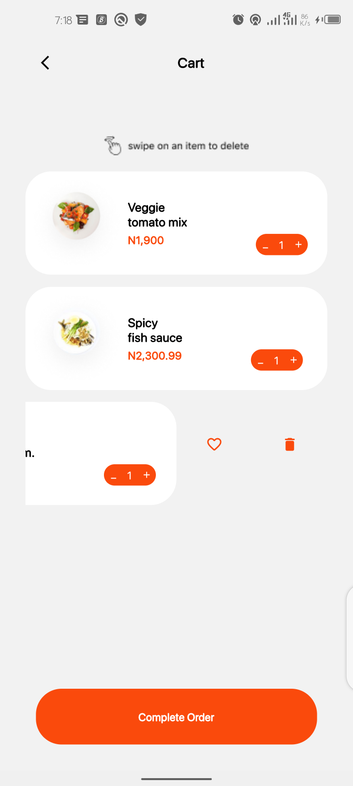 |  |

| 9                                  | 10                                  |
| ---------------------------------- | ----------------------------------- |
| 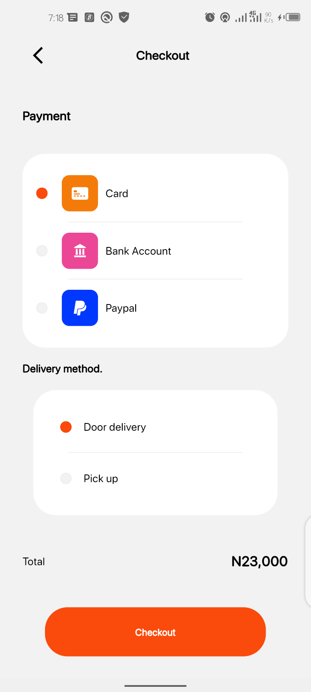 | 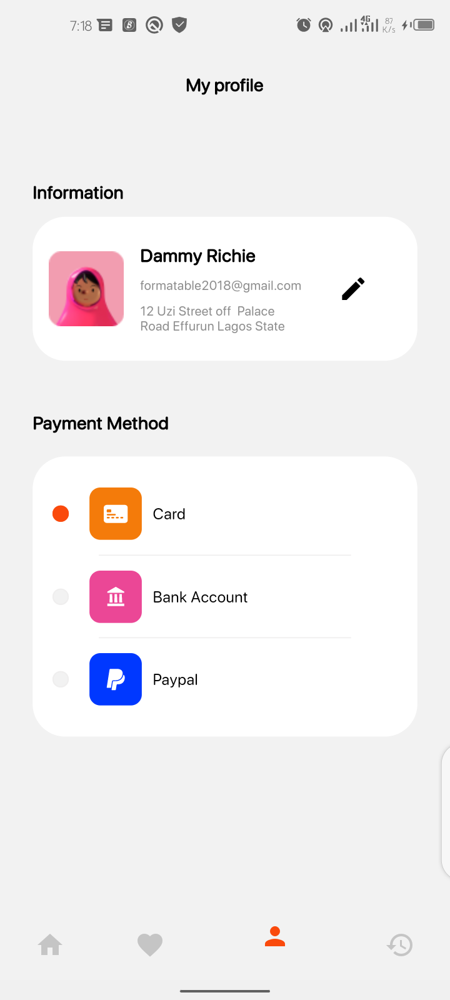 |

| 11                                  | 12                                  |
| ----------------------------------- | ----------------------------------- |
| 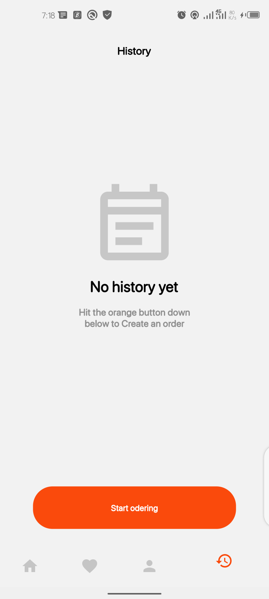 | 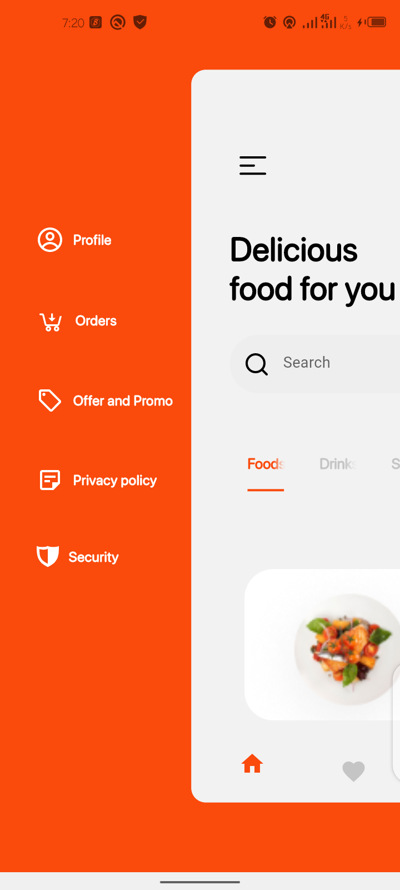 |

| 13                                  | 14                                  |
| ----------------------------------- | ----------------------------------- |
|  | 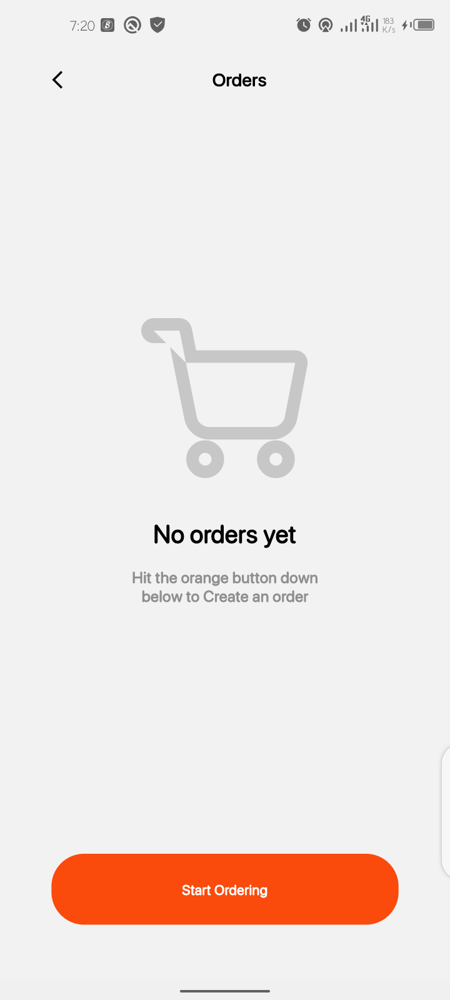 |

| 15                                  |
| ----------------------------------- |
| 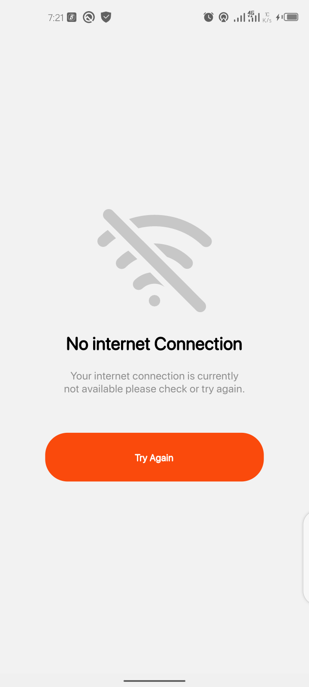 |

# Command

### Install dependencies

```sh
flutter pub get
```

### Run application

```sh
flutter emulators --launch <emulator_name>
flutter run
```

### Build

```sh
flutter build apk
```

# Plugins

- [connectivity](https://pub.dev/packages/connectivity)
- [flutter_screenutil](https://pub.dev/packages/flutter_screenutil)
- [flutter_svg](https://pub.dev/packages/flutter_svg)
- [google_fonts](https://pub.dev/packages/google_fonts)
- [flutter_slidable](https://pub.dev/packages/flutter_slidable)
- [flutter_native_splash](https://pub.dev/packages/flutter_native_splash)
<!-- - [fl_chart](https://pub.dev/packages/fl_chart)
- [flutter_local_notifications](https://pub.dev/packages/flutter_local_notifications) -->

## Author

👤 **Dammy Richie**

- Github: [@Dammy Richie](https://github.com/ichie2)

## Contributors

👤 **Dammy Richie**
